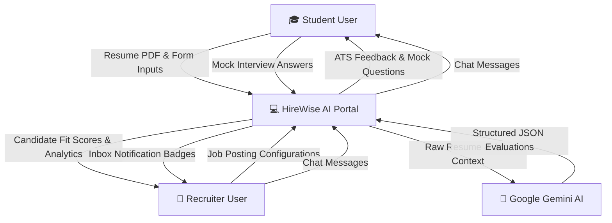
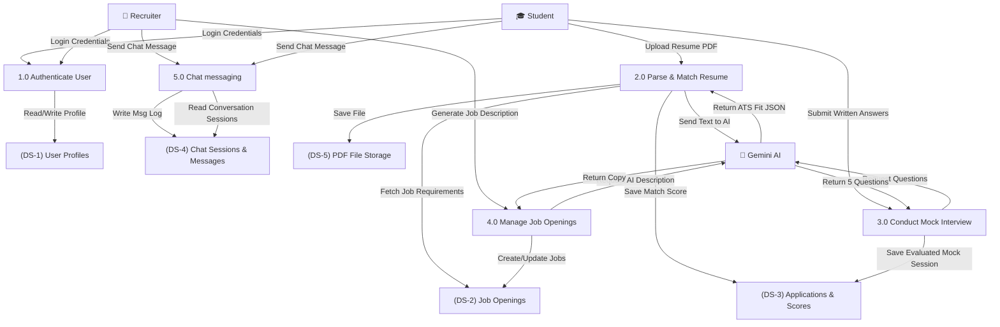
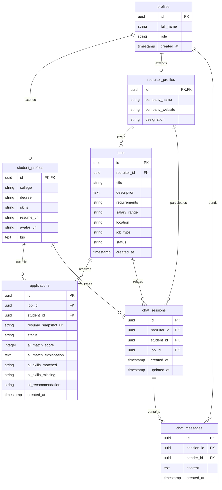

# HireWise AI: System Documentation & Technical Report

---

### **Project Information**
*   **Project Title**: HireWise AI — AI-Powered Recruitment, ATS Screening & Candidate Chat Portal
*   **Live Deployed URL**: [https://hirewise-ai-black.vercel.app/](https://hirewise-ai-black.vercel.app/)

### **Project Team Details**
*   **Group Lead**: Siya Chauhan (SAP ID: **500121922**)
*   **Group Member**: Vishesh Duggal (SAP ID: **500119110**)

---

## 📋 Table of Contents
1. **Introduction (What is the project?)**
2. **Project Motivation (Why was it built?)**
3. **System Architecture (How does it work?)**
4. **Data Flow Diagrams (DFD Level 0 & Level 1)**
5. **Database Design & ER Diagram (ERD)**
6. **Deployment & Technical Stack**
7. **Developer Manual (How to Use, Maintain, and Extend)**

---

## 1. Introduction (What is the project?)
**HireWise AI** is a state-of-the-art, full-stack recruitment portal designed to automate candidate screening, resume optimization, and mock interviewing using advanced Large Language Models (LLMs). It serves two main portals:

### **Student Portal**
*   **ATS Scanner & Optimizer**: Uploads PDF resumes and retrieves match scores, identified strengths, keywords gaps, and recommendations.
*   **AI Technical Screen Mock Interviews**: Initiates mock interviews tailored to a target role. Students complete 5 audio/written technical screen questions, which the AI engine evaluates.
*   **Applications Track Page**: Monitors real-time hiring progress (applied, screening, shortlisted, selected, rejected).
*   **Real-time Recruiter Chat**: Connects candidates directly with hiring managers.

### **Recruiter Portal**
*   **Analytics Dashboard**: Visualizes recruitment funnels (Applications, Screenings, Selected candidates) with charts.
*   **Postings Manager**: Lets recruiters write, publish, and close job postings. Features a Gemini AI assistant to automatically generate detailed job descriptions.
*   **Candidates Directory**: Renders applicant lists sorted by AI ATS match scores.
*   **Direct Chat Inbox**: Coordinates evaluations with individual candidates.

---

## 2. Project Motivation (Why was it built?)
Traditional recruitment pipelines suffer from friction on both sides:
*   **The "Black Hole" Effect for Students**: Candidates apply for dozens of roles, receive generic automated rejection emails, and have no insights into why their resumes failed or how to improve their skills.
*   **Review Fatigue for Recruiters**: Hiring managers must manually screen hundreds of resumes for a single opening. Important details are missed, and qualified candidates are overlooked due to time constraints.
*   **Practice Gaps**: Students lack realistic technical screening preparation, which leads to high failure rates in early rounds.

**HireWise AI** was built to bridge this gap by providing an intelligent system that acts as a career coach for students (providing resume feedback and technical screen mock practices) and an automated matching filter for recruiters (ranking applicants based on AI-verified qualifications).

---

## 3. System Architecture (How does it work?)
The application is structured into a distributed, multi-service environment:

1.  **Frontend Client (React/Vite)**: Runs in the user's browser, providing a modern, glassmorphic layout. It interacts with Supabase for user authentication and makes REST requests to our backend API.
2.  **Backend API Server (Node.js/Express)**: Handles system routing, downloads resume files, translates PDF text streams, and communicates with Google Gemini AI.
3.  **Database & Storage (Supabase)**:
    *   **PostgreSQL**: Stores relational tables (Profiles, Jobs, Applications, Messages).
    *   **Storage Buckets**: Stores files (PDF resumes, profile pictures).
    *   **Auth Service**: Authenticates users and checks role claims (Student vs. Recruiter).
4.  **AI Engine (Google Gemini AI)**: Evaluates resumes, aligns candidate profiles with jobs, generates interview questions, and evaluates technical answers.

---

## 4. Data Flow Diagrams (DFDs)

### **DFD Level 0: Context Diagram**
The Context Diagram represents the high-level boundary of the HireWise AI system, showing data exchanges between the core application and external entities.



---

### **DFD Level 1: Process Breakdown Diagram**
The DFD Level 1 breaks the system down into five main functional processes, displaying how they read and write to specific data stores.



---

## 5. Database Design & ER Diagram (ERD)

The database runs on PostgreSQL (Supabase) and consists of tables linking users, profiles, jobs, applications, and messaging logs.



---

## 6. Deployment & Technical Stack

*   **Production Frontend**: Hosted on **Vercel**
    *   *Routing configuration*: Configured with `vercel.json` rewrites to route deep page requests back to `index.html` (resolves page refresh crashes).
*   **Production Backend**: Hosted on **Render** (Web Service tier)
    *   *Port Configuration*: Listens on dynamic environment `PORT` and communicates securely with database pools and AI SDKs.
*   **Database & File Cloud**: Hosted on **Supabase**
    *   *Storage Policies*: RLS (Row-Level Security) policies enabled on storage tables (`storage.objects`) allowing authenticated users to upload to `/resumes` and `/avatars`.
    *   *Admin Privileges*: Controllers utilize `supabaseAdmin` internally to query user profiles securely without RLS blocks.

---

## 7. Developer Manual (How to Use, Maintain, and Extend)

### **Local Environment Installation**
1.  **Clone code**:
    ```bash
    git clone https://github.com/siya2040/hirewise-ai.git
    ```
2.  **Database Configuration**:
    *   Execute the SQL tables schema (`database/schema.sql` and `database/chat_schema.sql`) inside your Supabase dashboard.
3.  **Run Backend Server**:
    *   Create a `server/.env` file with your `GEMINI_API_KEY`, `SUPABASE_URL`, and `SUPABASE_SERVICE_ROLE_KEY`.
    ```bash
    cd server
    npm install
    npm run dev
    ```
4.  **Run Frontend Client**:
    *   Create a `client/.env` file listing `VITE_SUPABASE_URL`, `VITE_SUPABASE_ANON_KEY`, and `VITE_API_URL` pointing to local/remote server.
    ```bash
    cd client
    npm install
    npm run dev
    ```

### **System Maintenance**
*   **AI Parser Reliability**: The Gemini service utilizes the custom helper `parseSafeJSON` to automatically strip code fence markers (` ```json ... ``` `) which prevent non-deterministic JSON parse crashes.
*   **Token Refreshing**: Supabase auth tokens are automatically synced inside `client/src/lib/api.js` on every server REST request, keeping users logged in securely.

### **Extension Roadmap**
1.  **WebSocket Chat**: Upgrade the current polling interval inside the chat pages to a WebSocket gateway (e.g., Socket.io) for instant message delivery.
2.  **Voice Mock Interviews**: Use speech-to-text Web APIs to let students speak their mock interview responses directly.
3.  **Email Alerts**: Hook up a mail utility (like SendGrid) on the Render backend to trigger emails when a recruiter selects or messages a candidate.
