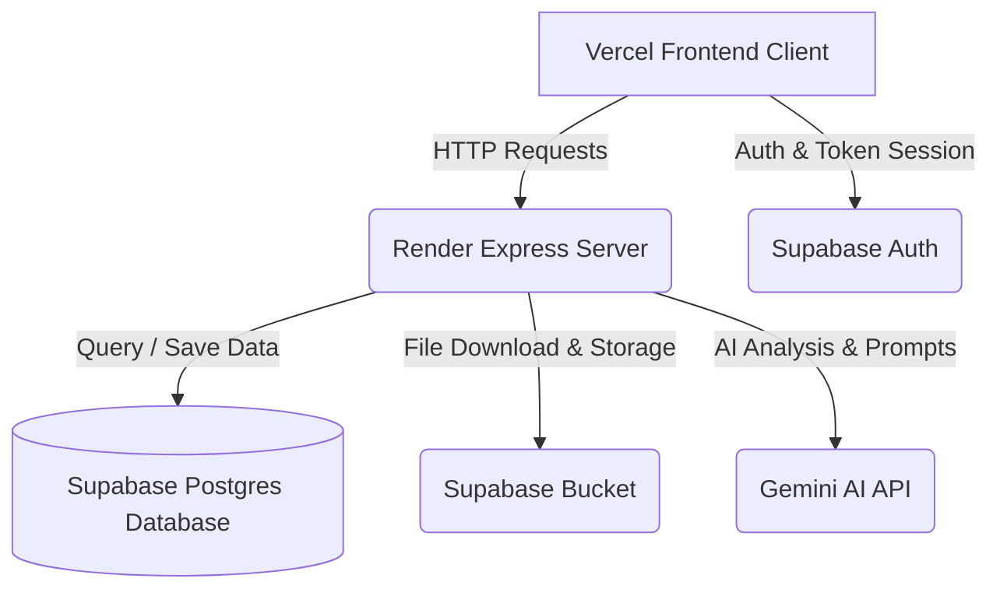

# HireWise AI 🤖

HireWise AI is a premium, full-stack recruitment platform powered by Google Gemini AI. It streamlines the hiring pipeline for both students and recruiters by providing intelligent resume parsing, automated ATS score matching, interactive AI technical mock interviews, and a real-time recruiter-candidate messaging system.

---

## 🚀 Key Features

### 🎓 For Students
*   **AI Resume Scanner & Optimizer**: Upload resume PDFs to get instant ATS scores, parsed skills lists, strengths/weaknesses reviews, and actionable improvement recommendations from Gemini.
*   **AI Technical Screen Mock Interviews**: Select target roles and complete structured 5-question mock interviews. The AI interviewer evaluates your audio/written answers and scores your performance.
*   **Job Listings Directory**: Browse available roles, review formatted descriptions, search, filter, and apply instantly.
*   **Track Applications**: Follow your application status (Applied, Screening, Selected, Rejected) in real time.
*   **Recruiter Chat**: Communicate directly with corporate recruiters to coordinate meetings and schedules.

### 🏢 For Recruiters
*   **Corporate Dashboard**: Monitor hiring analytics (Jobs Posted, Active Openings, Applicants, Selected candidates) with interactive funnel charts and graphs.
*   **AI Job Posting Manager**: Create and edit vacancy listings. Generate premium description copies using Gemini AI.
*   **Applicants Screening Sheet**: Review candidate profiles, download resume snapshots, and analyze their Sparkled AI Fit matching score.
*   **Chat Inbox**: Message candidates directly to coordinate evaluations or share updates.

---

## 🛠️ Tech Stack

*   **Frontend**: React (Vite), Tailwind CSS, Lucide Icons, Recharts, React Router
*   **Backend Server**: Node.js, Express, Google Generative AI (Gemini SDK), pdf-parse
*   **Database & File Storage**: Supabase (PostgreSQL, Storage Buckets, Auth)
*   **Hosting**: Vercel (Frontend), Render (Backend)

---

## 📐 Architecture Diagram



---

## 🔑 Environment Configuration

To run this project, configure the following environment variables:

### 1. Server Configuration (`server/.env`)
Create a `.env` file inside the `server` directory:
```env
PORT=5000
SUPABASE_URL=https://your-project-id.supabase.co
SUPABASE_SERVICE_ROLE_KEY=your-supabase-service-role-key
GEMINI_API_KEY=your-gemini-api-key
```

### 2. Client Configuration (`client/.env`)
Create a `.env` file inside the `client` directory:
```env
VITE_SUPABASE_URL=https://your-project-id.supabase.co
VITE_SUPABASE_ANON_KEY=your-supabase-anon-key
VITE_API_URL=http://localhost:5000/api
```

---

## 💻 Local Setup & Installation

### Prerequisites
*   [Node.js](https://nodejs.org/) (v18 or higher recommended)
*   A [Supabase](https://supabase.com/) account and project
*   A [Google AI Studio](https://aistudio.google.com/) API Key for Gemini

### Step 1: Clone the Repository
```bash
git clone https://github.com/siya2040/hirewise-ai.git
cd hirewise-ai
```

### Step 2: Database Setup
Execute the SQL schemas located in the `database/` folder inside your **Supabase SQL Editor**:
1.  Run `database/schema.sql` to initialize profiles, jobs, applications, and notifications.
2.  Run `database/chat_schema.sql` to initialize the messaging structures.
3.  *Note*: Ensure you create two public buckets in Supabase Storage named `resumes` and `avatars` and configure public read/write RLS policies.

### Step 3: Run the Backend Server
```bash
cd server
npm install
npm run dev
```
The server will boot on `http://localhost:5000`.

### Step 4: Run the Frontend Client
Open a new terminal window:
```bash
cd client
npm install
npm run dev
```
The client app will launch on `http://localhost:5173`.
